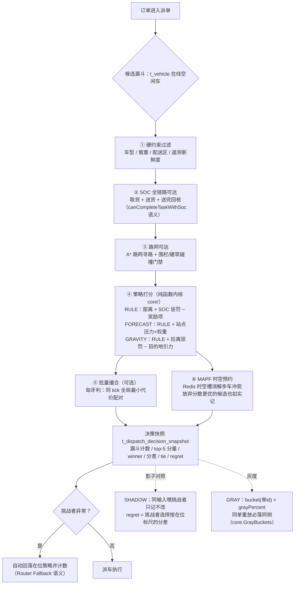

# DispatchFlow 面试讲解图（决策链与可靠投递）

> 面试就绪路线图 §5 验收包的两张图。数据口径与证据指针见《面试就绪任务路线图 2026-09-27》与活文档；两张图都可用 Mermaid 渲染（GitHub 原生支持）。

## 1. 决策解释图：一单是怎么派出去的



三分钟讲法：先用硬约束把"根本不能派"的车挡在漏斗外（SOC 是全链路的——接单那一刻就保证送完还能回桩）；再在可派集合里用可解释打分排序；多车冲突交给时空预约，分数更优的候选被 MAPF 否掉是正常现象且留在快照里；策略升级走 SHADOW→GRAY→PRIMARY，影子只记不改，灰度按稳定分桶，挑战者崩了自动回落——所以"换策略"永远不会让一单没人接。

## 2. 可靠投递图：决策之后事件怎么不丢

```mermaid
flowchart LR
    A[派单事务<br/>MySQL 真相] -->|"同事务写"| B[(outbox 表)]
    B --> C{Outbox 重试调度<br/>（无分布式事务）}
    C --> D[[RabbitMQ]]
    D --> E[Audit 审计消费者]
    D --> F[SSE 推流<br/>工作台 / 大屏 / 追踪页]
    D --> G{Webhook 投递}
    G -- 成功且幂等标记成功 --> H[完成]
    G -- 投递失败 --> DLQ[[(Webhook DLQ)<br/>死信不重排队<br/>事件保持可重放]]
    G -- 幂等标记失败 --> DLQ
    C -- "投递成功" --> C1[(outbox 标记已发)]
```

三分钟讲法：MySQL 是唯一真相，事件用 Outbox 模式与业务同事务落库，再由重试调度异步投递——没有跨库分布式事务；消费端每条事件带幂等键，"投递成功但标记失败"按失败处理进 DLQ，宁可重放不可静默丢；DLQ 不自动重排队，事件本体保持可重放，复盘时能从头再放一遍。运行态（SSE 流）是易失视图，丢了不影响真相，重建即可。

## 3. 配套的"诚实边界"口头清单

- 仿真/压测数字必须带环境标签（H2/Fake Redis ≠ MySQL/Real Redis；旧图 17.84/1.481 ≠ 现行 seed 18.73/1.416）。
- 单副本是设计前提：13 个调度器无分布式锁、仿真运动状态在 JVM 内、SSE 连接实例本地——扩副本前先做三件前置。
- PostGIS 默认关闭、未进热路径：线性扫描 p95 0.057 ms vs PostGIS 1.7–2.3 ms，交叉点 N≈5,000。
- 预测只影响错峰补能，不参与安全约束与不可达判断，预测失效自动退回纯阈值（门禁实测阻断记录在案）。
