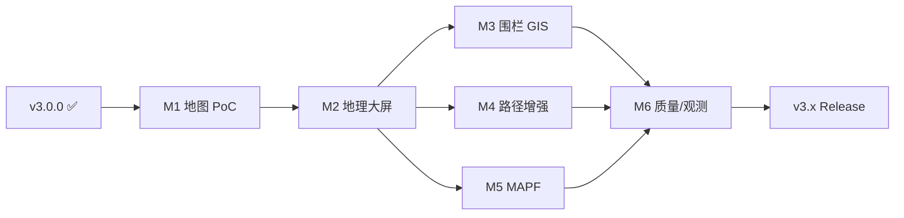

# DispatchFlow V3 产品路线图

> **基线 Release**：[`v3.0.0`](./releases/v3.0.0.md)（Phase 1–15 已交付）· [在线演示](https://www.aplicity.online)  
> **地图选型**：**高德 JS API 2.0** · 接入说明 [`v3/AMAP-SETUP.md`](./v3/AMAP-SETUP.md)  
> **需求设计**：[`REQUIREMENTS-DESIGN.md`](./REQUIREMENTS-DESIGN.md) · **文档索引**：[`README.md`](./README.md)  
> **最后更新**：2026-05-31

---

## 一、V3 版本概览

| 里程碑 | 主题 | 目标 Release | 进度 |
|--------|------|--------------|------|
| **M1** | 高德地图 PoC（叠石桥锚点） | — | `[x]` |
| **M2** | 地理监控大屏 | v3.1.0 | `[x]` |
| **M3** | 围栏 · 多园区 GIS | v3.2.0 | `[x]` |
| **M4** | 物流路径增强（可选） | v3.x | `[x]` |
| **M5** | MAPF 实时避障 | v3.x | `[x]` |
| **M6** | 质量 · 安全 · 可观测 | v3.x | `[ ]` |

**V2 已交付摘要**：见 [`archive/ROADMAP-V2-closed.md`](./archive/ROADMAP-V2-closed.md)

---

## 二、M1 — 高德地图 PoC

> **选型结论**：高德（GCJ-02）· 详见 [`v3/MAP-PROVIDER-EVALUATION.md`](./v3/MAP-PROVIDER-EVALUATION.md)  
> **Key 配置**：[`v3/AMAP-SETUP.md`](./v3/AMAP-SETUP.md) · 验证页 `/dev/map-poc`

- [x] 注册高德 Web JS API Key + 安全密钥 + 域名白名单
- [x] 更新 `front/.env.example` 占位变量
- [x] 前端 `MapProvider` 抽象（`AmapProvider` + `SCHEMATIC` 预留）
- [x] 高德 JS API 2.0 动态加载（`@amap/amap-jsapi-loader` · `AmapGeoMap.vue`）
- [x] 选型结论文档（高德 vs 百度 → **高德**）
- [x] 叠石桥家纺产业带地理锚点 + mock 车 GCJ-02 映射（V21 + `ParkGeoTransformService`）
- [x] 本地 `/dev/map-poc` 目视验收（4 辆快递车在叠石桥片区移动）

---

## 三、M2 — 地理监控大屏

- [x] Flyway **V21**：`t_park` 增加 `center_lng` / `center_lat` / `map_provider`（迁移脚本已编写，部署时执行）
- [x] `CoordinateTransformService`：GCJ-02 ↔ 园区 `x/y`（≥3 控制点标定 API）
- [x] `Tracking.vue` 双模式 Tab：「调度图 | 地理图」
- [x] REAL / VDA5050 遥测 `latitude` / `longitude` 写入 Redis 并在地理图展示
- [x] 地图实例 `shallowRef` + 路由切换 `destroy()`，消除内存泄漏

---

## 四、M3 — 围栏与多园区 GIS

- [x] 园区地理围栏 CRUD + 越界告警（可挂接自动化规则）
- [x] 多园区总览页：区域尺度车辆分布（Marker 聚合）
- [x] 站点 / 充电位可选绑定经纬度（保留 `x/y` 调度坐标）
- [x] 无 Key / 离线环境回退 Leaflet 调度图，演示环境不白屏

---

## 五、M4 — 路径增强（可选）

- [x] 评估高德物流矩阵 N-1，接入 REAL 派单距离评分
- [x] 另建「Web服务」Key 供后端物流 API（与 JS API Key 分离）
- [x] 文档明确边界：公开道路路径**仅展示/估算**，不替换 `ParkRoutePlanner`

---

## 六、M5 — MAPF 规模化

> 架构评估：[`v3/MAPF-EVALUATION.md`](./v3/MAPF-EVALUATION.md)

- [x] Zone 图分区模型 + Redis 时空预约表 MVP
- [x] 派车链路集成预约冲突检测与重规划
- [x] 50 车仿真验收：零对向冲突
- [x] 200 车压测：规划 P95 &lt; 500ms
- [ ] （可选）外置 gRPC 求解器，1000 车登记 / 200 并发

---

## 七、M6 — 质量 · 安全 · 可观测

### 7.1 质量与安全

- [ ] 单测覆盖率 → 80%（JaCoCo 报告已接入 CI，持续补测中）
- [x] 字段级敏感数据加密（TOTP secret / Webhook secret · `FieldEncryptionService`）
- [x] Checkstyle / SpotBugs 静态规则（`mvn -Pquality`）

### 7.2 可观测性

- [x] ELK 日志聚合方案与 compose 栈（Filebeat → Elasticsearch → Kibana）
- [x] Zipkin / Jaeger 全链路追踪接入（Micrometer Brave + Zipkin compose）
  _已有：Prometheus + Grafana · [`docker-compose.observability.yml`](../back/docker-compose.observability.yml) · 说明 [`v3/OBSERVABILITY.md`](./v3/OBSERVABILITY.md)_

---

## 八、明确不做 / 延后

以下**不纳入 V3 勾选**，仅作范围约束：

- 大模型调度助手
- 分拣线 / NC 交叉带 WCS
- 真 3D / VR 数字孪生
- 强化学习派车
- 深度 ERP 单据同步

---

## 九、代码锚点

**技术栈**：Java 21 · Spring Boot 3.3 · MySQL · Redis · RabbitMQ · Vue 3 · TS · Leaflet · **高德地图** · SSE · Docker · Flyway · Prometheus · VDA5050 MQTT

| 主题 | 路径 |
|------|------|
| 高德接入说明 | `docs/v3/AMAP-SETUP.md` |
| 地图选型评估 | `docs/v3/MAP-PROVIDER-EVALUATION.md` |
| 前端 MapProvider | `front/src/maps/` |
| 地理地图组件 | `front/src/components/map/AmapGeoMap.vue` |
| MAPF 评估 | `docs/v3/MAPF-EVALUATION.md` |
| M4 物流路径边界 | `docs/v3/LOGISTICS-PATH.md` |
| MAPF 预约 / 分区 | `back/.../mapf/MapfRoutePlannerService.java` |
| 高德物流矩阵 | `back/.../geo/amap/AmapLogisticsDistanceService.java` |
| 字段加密 | `back/.../common/security/FieldEncryptionService.java` |
| 可观测性栈 | `back/docker-compose.observability.yml` · `docs/v3/OBSERVABILITY.md` |
| FleetAdapter | `back/.../fleet/FleetAdapterRegistry.java` |
| VDA5050 | `back/.../fleet/vda5050/Vda5050MqttGateway.java` |
| 需求模板 | `docs/REQUIREMENTS-DESIGN.md` |

---

**维护**：完成项将 `- [ ]` 改为 `- [x]`；PR 前缀 `[V3]`、`[V3-Map]`、`[V3-MAPF]`。
