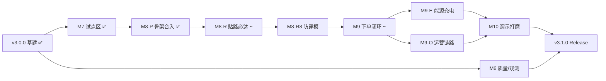

# DispatchFlow V3 产品路线图（已关闭 · 归档快照）

> **状态**：✅ 已归档 · **关闭日** 2026-06-04  
> **当前路线图**：[`ROADMAP-V4.md`](../ROADMAP-V4.md)  
> **未完成项**：已迁入 V4 §八；勿在本文件新增 `- [ ]`  
> 下文为关闭时的 **完整 V3 文档**（相对链接以 `docs/` 目录为根）。

---

# DispatchFlow V3 产品路线图

> **基线 Release**：[`v3.0.0`](../releases/v3.0.0.md)（Phase 1–15 + 地图/MAPF 基建）· [在线演示](https://www.aplicity.online)  
> **地图选型**：**高德 JS API 2.0** · [`v3/AMAP-SETUP.md`](../v3/AMAP-SETUP.md)  
> **送货范围规范**：[`require.md`](../require.md) · [`v3/ZJF-DELIVERY-ZONE.md`](../v3/ZJF-DELIVERY-ZONE.md)  
> **需求设计**：[`REQUIREMENTS-DESIGN.md`](../REQUIREMENTS-DESIGN.md) · **文档索引**：[`README.md`](../README.md)  
> **最后更新**：2026-06-01（require.md V3.1 合入 · 待办清单精简 · M8-R7 · M9-E · M9-O · M10）

---

## 〇、v3.1 交付焦点（用户视角）

> 从高频使用者角度：**产品「像不像真系统在跑」** 仍是最大差距。技术骨架（M8-P、双地图分层、移动下单闭环）已合入，但演示信任与日常运营仍被三类问题阻塞。

**若 v3.1 只能关三件事**（按用户价值排序）：

| 优先级 | 里程碑 | 用户感知 |
|--------|--------|----------|
| **P0-1** | **M8-R7** 贴路闭环验收 | 打开地图即「车在道路上跑」，不穿楼、不穿河（R8 已合入） |
| **P0-2** | **M9-E** 能源充电 | 演示车不会半路「跑死」；地图能看懂为何去充电 |
| **P0-3** | **M9-O** 运营链路收拢 | PC 能下单、订单/任务一键跟车，不必跳移动端 |

**P1（日常效率）**：配置自检页 · 列表页静默刷新 · 订单详情人性化 · 演示默认入口  
**P2（打磨）**：M10 品牌/演示模式 · 移动页隐藏 API Key · 组件拆分 · 文档同步

---

## 一、产品愿景（找家纺网 · 短驳配送）

### 1.1 要交付什么

**不是**「调度示意图里小车乱飘」，**而是**在高德真实底图上：

1. **无人车位置正确** — 经纬度来自沿路插值或真实遥测，Marker 落在**道路上**，不穿楼
2. **送货轨迹正确** — 取货 / 送货 / 回场分段为**高德道路 polyline**，与订单、任务阶段一致
3. **无人车图标可识别** — 参考行业 L4 配送车平台（新石器、白犀牛、九识等）的**俯视图/扁平车标**，按状态变色、随路径转向
4. **运营区域可信** — 对齐找家纺在川姜/叠石桥的**真实产业带范围**（文档与图例），演示派单在**等比例缩小试点区**内完成
5. **用户正常下单** — 自动派车，订单状态与车辆任务、地图轨迹一致

一句话：**打开地图 → 下单 → 看定制无人车图标沿路跑 → 货到代发仓/门市**。

### 1.2 业务场景（找家纺）

| 项 | 说明 |
|----|------|
| **客户** | 找家纺网（南通云尚找家纺）类 B2B 网销平台 |
| **货物** | 家纺小包/包裹（门市拿货 → 代发仓出库） |
| **典型链路** | 门市/工厂 **取货点** → 无人车 **道路配送** → 代拿仓/代发仓 **送货点** |
| **公开路线参考** | 川姜镇片区：温州东路、川叠路、金川大道等（见南通网报道） |
| **非目标** | 不做全国 L4；不替代园区 `ParkRoutePlanner` 做厂内 AGV；不做 ERP 深度对接 |

### 1.2.1 找家纺真实运营范围（资料归档 · 截至 2026-05）

> 以下用于**文案、图例、L0 覆盖圈**；演示派单与仿真仍在 **L1 试点区**（§1.3）。细节坐标见 [`v3/ZJF-DELIVERY-ZONE.md`](./v3/ZJF-DELIVERY-ZONE.md)。

| 维度 | 内容 |
|------|------|
| **主范围** | 江苏省南通市通州区**川姜镇**（家纺城）、海门区三星镇**叠石桥**，覆盖南通家纺产业带 |
| **辐射** | 以家纺城 / 叠石桥为中心，**20 km** 内工厂、电商、仓库、直播间、快递网点 |
| **路网规模** | 规划线路总里程 **17600 km**，运营线路 **3066** 条，服务点位 **3485** 个 |
| **服务对象** | 家纺工厂 **260+**、电商/直播 **380+**、仓库/代发、快递网点、产业带商户 |
| **核心场景** | 工厂 ⇌ 仓库；仓库 ⇌ 电商/直播；仓库 ⇌ 快递网点；园区内短途、样品急送 |
| **能力与规模（2026-01）** | L4 无人车 **264** 辆（年底计划 **500**）；星环枢纽单日吞吐 **20 万件**；比传统物流快 **3h+**；单车日均 **7.9** 趟、峰值 **12+** 趟 |
| **叠石桥参考锚点（GCJ-02）** | `121.080000, 31.980000`（图例用，可微调；与川姜锚点并列） |

**暂不覆盖（与 §十 一致，系统需拦截或文案说明）**：

- 产业带 **20 km 外**（暂无跨城/长途；L0 图例仅作展示）
- 非产业带散户 C 端（当前 **B2B**）
- 禁行路段、高速、高架等封闭/快速路
- **叠石桥第二试点**（V3.1 后可选 `ZJF_DIESHIQIAO_PILOT`）
- **全量仿真**：264 车 × 3485 点仅作文档/图例；演示限制 **4–12** 车于 L1
- **园区内部 AGV**：厂内搬运仍由 `ParkRoutePlanner` + MAPF 负责，不纳入短驳地理

### 1.3 地理范围三层模型（真实 → 演示）

演示系统**不**在地图上直接展开 20 km 全圈（点位过密、无法验收「沿路跑」）。采用三层结构：

| 层级 | 名称 | 尺度 | 作用 |
|------|------|------|------|
| **L0** | 真实覆盖（图例） | 川姜 + 叠石桥双中心，各 **20 km** 淡色圆/扇区 | 说明找家纺真实送货能力；**不参与**派单与围栏校验 |
| **L1** | 演示运营区（试点） | 单中心 **1570m × 470m**（≈0.74 km²） | 围栏、站点、派单、越界告警；默认场景 `ZJF_DIESHIQIAO_PILOT` |
| **L2** | 单笔订单可视区 | 取货站 → 送货站道路 polyline + 跟车视野 | M8/M9 验收主战场；**动态**，不改变 L1 围栏 |

**L0 图例层**（[`require.md`](./require.md) §三 · 不参与派单与围栏校验）：

| 中心 | GCJ-02 | 说明 |
|------|--------|------|
| 川姜镇 | `121.062280, 31.912450` | 主试点中心，与 V21 锚点一致 |
| 叠石桥 | `121.080354, 31.961977` | L1 主试点中心，与 V27 锚点一致 |

- 川姜 + 叠石桥各 **20 km** 淡色圆形/扇区
- 可选标注「264 辆 / 全网运营」等叙事数据
- 文案说明「20 km 外暂未开通」

**L2 单笔订单可视区**（[`require.md`](./require.md) §五）：以取货站 → 送货站道路 polyline 为核心，叠加 `plannedRouteGeo` · `geoTrajectory` · 车辆实时 `longitude/latitude` · 充电站/待命点（如触发回充）。

**等比例缩小规则**（L1 相对 L0）：

```text
R_demo ≈ R_real × (L_typical / 20 km)

R_real = 20 km（产业带辐射半径）
L_typical = 试点内典型单程路面距离，取 2–5 km（短驳）
→ 试点矩形边长约 0.8–1.2 km，与 960m×640m 同量级

V3.1 采用**固定 L1 矩形**，不按每单动态调整围栏；L2 视野可按本单路面距离微调缩放。
```

**L2 视野缩放（可选，不改变 L1 围栏）**：

```text
以发货仓/锚点 S 为心，按本单路面距离 L_order 微调 L2 视野
- 短单（< 1 km）：zoom 17–18
- 中单（1–3 km）：zoom 15–16
- 长单（3–5 km）：zoom 14–15
```

相对 V22 默认 **2km×2km**，L1 约为原矩形的 **40%**，贴近「一个代发园区 + 周边 2–3 条支路」。

| 参数 | 值 | 说明 |
|------|-----|------|
| **场景代号** | `ZJF_DIESHIQIAO_PILOT` | 找家纺叠石桥短驳试点（V3.1 默认单中心） |
| **中心 GCJ-02** | `121.080354, 31.961977` | 与 V27 锚点一致 |
| **试点范围** | 约 **1570m × 470m**（≈0.74 km²） | 叠石桥家纺产业园 OSM 导出范围 |
| **围栏策略** | `t_park_geofence` 多边形 | 越界告警；演示车不得长期驶出 L1 |
| **演示车队** | **4–12** 辆在 L1 内跑动 | 图例标注「试点 N 辆 / 全网 264 辆」 |

**L1 围栏校验规则**（[`require.md`](./require.md) §4.3）：

1. **订单创建拦截**：取货/送货点必须在 L1 多边形内；越界拒绝并提示「当前仅支持叠石桥试点区」
2. **车辆运行监控**：仿真车辆不得长期驶出 L1；越界触发告警并自动规划回区路径
3. **站点准入**：仅允许 L1 内已启用站点参与派单

**站点类型与代码前缀**（保存前须 `StationRoadSnapService` 道路吸附；仿真起终点用 `snapGeo`）：

| 类型 | 代码前缀 | 作用 |
|------|----------|------|
| 取货门市 | `ZJF-PICK-*` | 工厂/门市取货 |
| 代发/代拿仓 | `ZJF-DROP-*` | 仓库送货 |
| 快递接驳 | `ZJF-HUB-*` | 快递网点转运 |
| 待命点 | `ZJF-IDLE-*` | 车辆待命/驻车 |
| 充电站 | `ZJF-CHG-*` | 低电回充（M9-E） |

> 禁止站点坐标直接落在建筑/水面/非道路区域；坐标系 **GCJ-02**，禁止混用 WGS-84 / BD-09。

**L1 试点区四角（GCJ-02，可微调）**：

```
(121.072051, 31.959885) — 西南
(121.088673, 31.959902) — 东南
(121.088674, 31.964101) — 东北
(121.072051, 31.964084) — 西北
```

**V3.1 后可选（非阻塞）**：`ZJF_DIESHIQIAO_PILOT` 叠石桥第二块 L1 试点，地图上 Hub 切换。

### 1.4 用户旅程与当前摩擦

#### 1.4.1 三类用户 · 理想路径

| 用户 | 理想路径 | 当前主要摩擦 |
|------|----------|--------------|
| **演示 / 客户参观** | `ParkOverview` → 移动下单 → 监控大屏（短驳地理）→ 跟车完成 | 环境 Key 多、首次易翻车；大屏默认「园区调度」；无一键演示模式 |
| **调度员 / 运营** | 工作台派车 → 订单/任务查状态 → 大屏处置 | PC 无下单入口；订单详情只见 ID 无站名；列表需手动刷新；任务排序仅本机 |
| **移动商户（B2B）** | 选站下单 → 地图跟车 → 到站通知 | 页面暴露 API Key；站点多时缺搜索/分组；无 ETA |

#### 1.4.2 地图真实感需求（位置 · 轨迹 · 图标）

| 能力 | 要求 | 里程碑 |
|------|------|--------|
| **车辆位置** | 地理 Tab 优先 `longitude/latitude`；仿真沿 M8 polyline 插值；禁止取送货点间直线穿模 | M8 |
| **送货轨迹** | 分段绘制：待命→取货、取货→送货、送货→回场；已走轨迹与计划路线区分线型/透明度 | M8、M9 |
| **订单联动** | 下单后聚焦指派车辆；`PENDING→…→COMPLETED` 与 polyline 阶段一致 | M9、M9-O |
| **无人车图标** | 小厢式 L4 **俯视图** SVG；状态色：空闲 / 运输中 / 充电 / 低电 / 离线；选中放大+车号+电量 | M8、M9-E、M10 |
| **电量与充电** | 快照下发 `batteryPercent` / `batteryStatus`；低电自动回充；L1 充电站地图与桩位占用；演示模式防「跑死」 | M9-E |
| **刷新** | 地理 Tab SSE/轮询 **≤3s**；订单/任务列表进行中状态 **≤10s** 静默刷新 | M9、M9-O |

#### 1.4.3 v3.0 → v3.1 仍存在的差距（2026-06 用户实测）

| 现象 | 根因 | 状态 / 里程碑 |
|------|------|----------------|
| 地理 Tab 上车辆/轨迹为**两点直线、穿楼** | 未配置 `FSD_AMAP_WEB_SERVICE_KEY` 且本地路网未命中 | **待** M8-R7 验收；R1–R3 代码已合入 |
| 路线顶点合格但仍穿河/穿楼 | 缺 polyline 面域碰撞校验 | **已修复** M8-R8 |
| 演示车半路「跑死」 | 电量不可见、无充电站与回充策略 | **待** M9-E |
| 地理图订单**虚线直连**取货—送货 | 前端额外绘制 pickup→dropoff 直线 | **已禁**（`includeOrderLines: false`） |
| 站点不在路上 | 种子坐标未道路吸附 | **已修复** M8-R5 · V24 |
| 调度图出现 ZJF 站点与斜线 | 短驳站点与园区 schematic 混绘 | **已修复** §1.8 · `stationLayers.ts` |
| 调度图 / 地理图 Tab 混用困惑 | 同一页双 Tab | **已修复** §1.8.1 场景分段 |
| 演示用户打开大屏却是园区图 | 默认场景为「园区调度」 | **待** M10 · 演示入口默认 geo |
| PC 无法下单、订单无法跟车 | 管理端缺创建入口与 deep link | **待** M9-O |
| 配置分散、首次演示易失败 | JS Key / Web Key / 移动 Key 三处配置 | **待** M8-R1 扩展 · 配置自检页 |
| 园区 schematic 内订单为直线 | **预期**（`ParkRoutePlanner` 园区路网） | 仅「园区调度」场景 |

> **结论**：M8 代码骨架与 R1–R6、R8 已合入；**R7 贴路验收**、**M9-E 能源**、**M9-O 运营链路** 关闭后，v3.1 方可对用户标「可演示、可日常用」。

### 1.5 产品决策（V3.1 默认口径）

| # | 议题 | V3.1 默认 | 备注 |
|---|------|-----------|------|
| 1 | 演示地理范围 | **单中心川姜** L1（§1.3） | 叠石桥第二试点延后 |
| 2 | 缩小基准 | **固定约 40%** 矩形 + §1.3 公式作文档说明 | 不按每单动态改 L1 围栏 |
| 3 | 图标风格 | **扁平品牌色俯视图**（监控大屏可读） | 写实 3D 延后 |
| 4 | v3.1 必达 | **M8-R7** + **M9-E** + **M9-O（PC 下单/跟车）** + L1 围栏 + 下单闭环 | R8 已合入；L0 图例、264 车统计为加分 |
| 5 | 叠石桥锚点 | 图例用 `121.08, 31.98`（GCJ-02） | 实施前可替换为精确坐标 |
| 6 | 双地图 | **园区调度 = schematic**；**短驳地理 = 高德**；`area=ZJF` 不进入调度图 | §1.8 |
| 7 | 监控大屏默认场景 | **后台审查**默认「园区调度」；**演示官方入口**（`ParkOverview`、移动页跳转、`?mode=geo`）默认「短驳地理」 | 见 M10 |
| 8 | 移动 API Key | 演示可用 env 内置；**生产/mobile 商户页不暴露 Key 输入框** | M10 |
| 9 | 品牌叙事 | 登录/工作台/大屏副标题统一「找家纺 · 川姜短驳」；可选展示 §1.2.1 产业带数据 | M10 |

### 1.6 验收口径（V3.1 演示）

| # | 场景 | 预期 |
|---|------|------|
| 1 | 地图打开 | 底图为高德；试点围栏可见；4+ 车 Marker 在**道路上**而非穿楼 |
| 2 | 下单 | **移动端或管理端**创建订单（取货站 A → 送货站 B） |
| 3 | 派车 | 30s 内任务分配；地图上该车 **plannedRouteGeo 顶点 ≥4**，沿道路折线 |
| 4 | 配送 | 车辆沿 polyline 插值移动（非站点间直线）；到站后订单状态推进 |
| 5 | 能源 | 地图常驻显示电量；低电（&lt;20%）自动回充；充电站可见且桩位占用正确；演示循环单不因电量耗尽中断 |
| 6 | 异常 | 危急电量（&lt;5%）强制驻车告警；离线仍走现有自动化规则；地图状态与任务一致 |
| 7 | 真实感 | 车辆为**定制 L4 图标**且沿道路移动；全程轨迹**贴合路网**、**不穿模**（R8）；L1 围栏内可完成下单配送 |
| 8 | 范围认知 | 地图可展示 **L0** 双中心 20km 图例（可选）；派单仅 **L1** 内站点 |
| 9 | 场景分层 | 监控大屏 **园区调度** 仅 `park-map.svg` + 可切换园区；**短驳地理** 仅高德 + ZJF 站点；二者不混显 |
| 10 | 运营链路 | 订单详情显示站名/车号/阶段；**「地图追踪」** 跳转 `?mode=geo&orderId=`；配置自检页全绿或明确告警 |
| 11 | 演示脚本 | 一键演示模式 **≤3 min** 完成 2 单短驳（可选含低电回充桥段） |

**合并验收一句话**：后台用「园区调度」审查厂内 AGV；对外演示走官方 geo 入口——川姜 L1 高德底图、定制无人车图标、道路 polyline 贴路且不穿模；电量可见、低电自动回充；**PC/移动均可下单**，订单一键跟车，30s 内派车且状态与地图一致。

### 1.7 贴路行驶 — 定义、分层与可测标准

**什么叫「贴路」**（**短驳地理**场景 / 移动高德图，非园区调度 schematic）：

| 层级 | 数据源 | 合格标准 | 不合格（当前常见） |
|------|--------|----------|-------------------|
| **L2 计划路线** | `plannedRouteGeo` | 顶点 **≥ 4** 且 `fromAmap=true` 或 `source=LOCAL_GRAPH`；折线沿底图可见道路；**R8** 面域碰撞 `invalid=false` | 仅 2 点；穿楼、穿河 |
| **L2 已走轨迹** | `geoTrajectory` | 逐 tick 沿计划 polyline 插值累积；与车辆 Marker 重合 | 直线段；与 x/y 线性映射混用 |
| **车辆位置** | `longitude/latitude` | 每 3s 更新；Marker 落在道路中心线附近（目视 ±1 车道） | 取送货点间线性插值 |
| **地图绘制** | 前端 polyline | **只**画 `plannedRouteGeo` + `geoTrajectory`；**禁止**订单 pickup→dropoff 直线 | 虚线直连站点 |

**双执行层（写进需求，避免再混淆）**：

```text
┌─────────────────────────────────────────────────────────────┐
│ L1 调度执行层（schematic）                                   │
│   ParkRoutePlanner + MAPF · 园区 x/y · 派单可达性 · 仍保留   │
└───────────────────────────┬─────────────────────────────────┘
                            │ 任务阶段 / 目标站点
                            ▼
┌─────────────────────────────────────────────────────────────┐
│ L2 地理展示层（GCJ-02 · v3.1 必达贴路）                      │
│   RoadRouteService → polyline → geoFollower 插值 → lng/lat   │
│   前端仅渲染后端 polyline，不自行「画直线」                    │
└─────────────────────────────────────────────────────────────┘
```

**路径解析优先级（M8-R 实施后）**：

1. **高德驾车路径** — `FSD_AMAP_WEB_SERVICE_KEY` + `fsd.amap.driving.enabled=true`（主路径）
2. **L1 本地路网图** — 试点内预置道路 polyline（无 Key / API 失败时 Demo 兜底，**必须 ≥4 顶点**）
3. **直线兜底** — 仅开发调试；**生产 Demo 与 v3.1 Release 禁止作为默认**；UI 须显示「未贴路」告警

**配置自检（M8-R1 + M10 扩展）**：

- `GET /admin/park/road-route/health` → `{ amapDriving, localGraph, lastFallbackCount }`（已有）
- **管理端配置自检页**（待建）：JS Key · Web 服务 Key · 移动 API Key · 最近降级次数 · 一键跳转文档
- `POST /admin/park/road-route/validate` → `{ crossesBuilding, crossesRiver, nearestRoadDistanceMeters }`（R8-3）
- 地理 Tab 顶栏：无贴路能力时显示 **「当前为直线模式，请配置 Web 服务 Key 或本地路网」**

### 1.8 双地图分层 — 调度图 vs 地理图（禁止混用）

找家纺 V3 同时存在**两套空间**，产品与实现上严格分离：

| 维度 | **园区调度**（schematic） | **短驳地理**（geo · 移动下单） |
|------|-------------------------|--------------------------------|
| **空间** | 园区内部 `park-map.svg` · 1200×800 px · A/B 区路网 | 川姜 L1 试点 · GCJ-02 · 高德底图 |
| **站点** | `area ≠ ZJF`（取货站 A* · 送货站 B* · 出货仓库…） | `area = ZJF`（`ZJF-PICK-*` · `ZJF-DROP-*` …） |
| **订单** | 园区内部派单（两端均为 schematic 站点） | 短驳下单（任一端为 ZJF 站点） |
| **轨迹** | 沿 `ParkRoutePlanner` 园区路网（示意直线可接受） | 沿 `RoadRouteService` 道路 polyline（M8-R 必达） |
| **典型用户** | 调度员 / 后台审查 | 运营演示、移动跟车、贴路验收 |

**识别规则**：`area === 'ZJF'` 或 `stationCode` 前缀 `ZJF-` → 仅地理层；代码见 `front/src/maps/stationLayers.ts`。

**禁止**：在调度图上渲染 ZJF 站点或短驳订单折线；用 schematic x/y 表示川姜真实道路位置。

#### 1.8.1 监控大屏场景切换（`Tracking.vue` · 2026-06 合入）

取消同一页「调度图 | 地理图」双 Tab，改为**场景分段**（localStorage 记忆）：

| 场景 | UI | 地图 | 默认进入 |
|------|-----|------|----------|
| **园区调度** | 工具栏可选 **园区** 下拉 | **仅** Leaflet + `park-map.svg` | 直接打开 `/vehicle-tracking` |
| **短驳地理** | 固定川姜 L1；标注「当前：川姜试点」 | **仅** `AmapGeoMap`（需 JS Key） | `?mode=geo` · 移动页跳转 · 演示官方入口 |

- 移动下单「在大屏跟车」→ `?mode=geo&orderId=&vehicleId=` 自动切 **短驳地理** 并聚焦车辆
- `ParkOrder.vue` 站点下拉仅 `filterGeoDeliveryStations`
- `ParkOverview.vue` 为 L1 短驳总览（独立路由，仅地理层；推荐演示第一站）

---

## 二、版本与里程碑总览



| 里程碑 | 主题 | 目标 Release | 用户价值 | 进度 |
|--------|------|--------------|----------|------|
| **M1–M5** | 地图基建 · 围栏 · 物流矩阵 · MAPF | v3.0.x | 技术底座 | 已交付 |
| **M6** | 质量 · 安全 · 可观测 | v3.x | 回归稳定 | 进行中（覆盖率 80% 未达标） |
| **M7** | 找家纺试点送货区 + 站点 GIS | v3.1.0 | L1 可派单 | 已交付 |
| **M8-P** | 道路路径代码骨架 | v3.1.0 | 贴路通道 | 已交付 |
| **M8-R** | **贴路行驶必达**（Key/本地路网 · R7 验收） | v3.1.0 | **地图像真的** | R1–R6 已合入；**R7 待跑** |
| **M8-R8** | **路线防穿模** | v3.1.0 | **不穿楼不穿河** | 已交付 |
| **M9** | 下单 → 派车 → 配送闭环 | v3.1.0 | 移动演示闭环 | 移动闭环已合入；贴路验收待 R7 |
| **M9-E** | **能源与充电** | v3.1.0 | **演示不跑死** | v3.1 阻塞 |
| **M9-O** | **运营链路收拢** | v3.1.0 | **PC 日常能用** | v3.1 阻塞 |
| **M10** | 演示脚本 · 品牌 · 配置体验 · polish | v3.1.0 | 参观/录屏顺滑 | 未开始 |

**V2 已交付摘要**：[`archive/ROADMAP-V2-closed.md`](./archive/ROADMAP-V2-closed.md)

---

## 三、V3.0 已交付（M1–M5 · 摘要）

> 详细勾选记录保留在 Git `v3.0.0` 前后提交；此处仅列能力边界。

| 里程碑 | 已交付能力 |
|--------|------------|
| **M1** | 高德 PoC、`MapProvider`、`/dev/map-poc`、叠石桥锚点 |
| **M2** | 地理监控 Tab、GCJ-02 遥测、坐标标定 API |
| **M3** | 围栏 CRUD、多园区总览、站点经纬度、Leaflet 回退 |
| **M4** | 高德物流矩阵 N-1 评分（REAL 派单）；**不**替代厂内路径 |
| **M5** | MAPF Zone + Redis 预约、50/200 车压测 |

**与 §1.4 真实感 / 运营需求的差距**（M8-R7 / M9-E / M9-O / M10 补齐）：

- **M8-R**：R1–R6、R8 已合入；**R7 贴路验收**待关闭
- **M9**：移动下单闭环、到站提示已合入；贴路跟车验收待 R7；**PC 下单/跟车**待 M9-O
- **M9-E / M9-O / M10**：见下文待办清单

---

## 四、M7 — 找家纺试点送货区（L1）· 已交付

> Flyway **V23–V24** 已合入：场景 `ZJF_CHUANJIANG_PILOT`（960×640 m）、L1 围栏与种子站点、GeofenceList 一键填充、L0 双中心图例（可选）、§1.8 双地图分层。规范细节见 [`require.md`](./require.md) · [`v3/ZJF-DELIVERY-ZONE.md`](./v3/ZJF-DELIVERY-ZONE.md)。

---

## 五、M8 — 道路路径、沿路行驶与地图轨迹

> **边界**：厂内 AGV 仍用 `ParkRoutePlanner` + MAPF（L1 执行）；**L2 地理层**必须贴路且不穿模（§1.7、R8）。  
> **用户感知**：M8 未完成 = 「像 PPT 动画，不像无人车在跑」。

### 5.0 现状诊断（2026-06）

```text
用户看到直线穿楼 / 穿河，通常同时满足以下 ≥1 条：

1. 后端 FSD_AMAP_WEB_SERVICE_KEY 为空且本地路网未命中
   → ChainedRoadRouteService 降级至 2 点直线（dev profile）

2. 前端地理 Tab 仍绘制 order pickup→dropoff 虚线 — 已禁

3. 站点 GCJ-02 不在真实道路中心 — R5 已修复（V24）

4. 用户停留在「调度图」场景（schematic 直线为预期，非 bug）

5. polyline 顶点 ≥4 但仍穿越建筑/水面 — R8 未实施

6. 首次演示未配 Key，ParkOverview 回退列表、移动页走 schematic — 待配置自检页（M10）
```

**v3.1 不再接受**：「顶点够多即合格」—— **未贴路或未通过 R8 防穿模，M8 即未完成**。

---

### 5.1 M8-P — 代码骨架 · 已合入

> 后端 `RoadRouteService` / `AmapRoadRouteService` / `RoadRouteFollower`；仿真 `geoFollower` → `lng/lat`；快照 `plannedRouteGeo` · `geoTrajectory`；前端 `AmapGeoMap` · `parkGeoMapLayers` · 定制 L4 SVG；页面 `Tracking.vue` · `ParkOverview.vue` · `ParkOrder.vue`。

---

### 5.2 M8-R — 贴路行驶必达（v3.1 阻塞 · R1–R6 已合入）

> **已合入**：R1 配置与 health 接口 · R2 高德驾车 · R3 本地路网兜底 · R4 前端禁直线与场景分段 · R5 站点道路吸附（V24）· R6 分段路径与 `RoadRouteFollower` 单测 · **R8 防穿模**（`RoadRouteCollisionValidator` · validate API · 前端遮罩）。

#### 待办

- [ ] **管理端配置自检页**：聚合 JS Key · Web 服务 Key · 移动 API Key · health 接口结果 · 文档链接（M10 合入或独立 PR）
- [ ] 园区调度场景标注「内部路网示意，非真实道路」（可选 tooltip）
- [ ] 短驳地理场景顶栏常驻 **「当前：川姜 L1 试点」**，避免与顶栏「全部园区」混淆（M9-O / M10）

#### R7 验收（M8-R 关闭条件）

> **自动化脚本**：[`scripts/m8-r7-accept.ps1`](../scripts/m8-r7-accept.ps1) · [`scripts/m8-r7-accept.sh`](../scripts/m8-r7-accept.sh) · 说明 [`v3/M8-R7-ACCEPTANCE.md`](./v3/M8-R7-ACCEPTANCE.md)

| # | 操作 | 通过标准 |
|---|------|----------|
| 1 | **短驳地理** 场景，4+ 仿真车 | 无穿楼直线轨迹；计划线顶点 ≥4 |
| 2 | 下单「门市 A→代发仓」，跟车 1 单 | 车辆 Marker 沿底图道路移动；完成段已走线与计划线重合 |
| 3 | 关闭 Web Key，仅本地路网 | 仍满足 #1–2（LOCAL_GRAPH） |
| 4 | health 接口 | `amapDriving` 或 `localGraph` 至少一项 true；无静默直线 |
| 5 | 录屏 30s | 审核员目视：全程 **不** 出现取送货点虚线直连 |
| 6 | **园区调度** 场景 | 仅 `park-map.svg`；无 ZJF 站点；无短驳订单折线 |
| 7 | **配置自检页** | 演示环境三项 Key 状态可见；降级次数可解释 |

#### R8 路线防穿模校验 · 已合入

> `RoadRouteResult.invalid` · 水域/建筑黑名单 · `POST /admin/park/road-route/validate` · 前端「路线异常」遮罩。PR 前缀：`[V3-Road]` · `[V3-Map]`。

---

### 5.3 与 [`LOGISTICS-PATH.md`](./v3/LOGISTICS-PATH.md) 的关系

| 文档原表述 | v3.1 修订 |
|------------|-----------|
| 公开道路路径仅「展示/估算」 | L2 **展示层必须贴路**；仿真 `lng/lat` 由 polyline 驱动 |
| ParkRoutePlanner 为唯一执行层 | **L1 派车/可达**仍唯一；**L2 地理运动**独立由 `RoadRouteService` + `geoFollower` 执行 |

---

## 六、M9 — 下单 → 派车 → 配送闭环

> **依赖**：**M8-R7** + **M8-R8（已合入）**；**M9-E** 为演示可靠性阻塞；**M9-O** 为运营日常阻塞。

> **已合入**：移动下单 `/mobile/order` · 自动派车 · 状态同步 · SSE/3s 刷新 · 到站 Toast · 4 条典型线路种子 · `?mode=geo` 跟车入口（贴路验收待 M8-R7）。

### 6.0 待办

- [x] **工作台 / 订单管理下单**：`订单管理 → 创建短驳订单` 弹窗（ZJF 站点 + 4 条典型线路）；管理端 Token 或移动 Key 均可 `POST /admin/park/orders`
- [x] **订单/任务 → 地图 deep link**：订单详情 / 任务详情「地图追踪」→ `?mode=geo&orderId=&vehicleId=`
- [ ] **地图贴路联动验收**：移动端正追踪 + `?orderId=&vehicleId=&mode=geo` 通过 M8-R7 七项标准

---

### 6.1 M9-E1 — 车辆电量实时可视化

- [x] **电量数据下发**：快照 `batteryLevel` + `batteryStatus`（`NORMAL` / `LOW` / `CRITICAL` / `CHARGING`）；地理图 Marker 低电/危急样式
- [ ] **地理图电量展示**：Marker tooltip 常驻电量；低电（&lt;20%）外圈橙闪；危急（&lt;10%）红闪
- [ ] **调度图电量展示**：schematic 车辆节点迷你电池图标（绿/橙/红）
- [ ] **电量面板**：`Tracking.vue` 短驳地理右侧「车队电量」折叠面板；一键筛选低电车

### 6.2 M9-E2 — 充电站基础设施（L1 试点）

- [ ] **充电站站点类型**：`StationType.CHARGING_STATION` + `chargerCount` / `fastChargerCount` / `maxPowerKw`
- [x] **充电站种子数据**：Flyway **V26** 预置 `ZJF-CHG-01/02/03`；仿真回充优先选充电站坐标
- [ ] **充电站地图渲染**：独立插头图标；点击显示桩位占用
- [ ] **管理端充电站 CRUD**：站点管理支持充电站；L1 内 + 贴路校验

### 6.3 M9-E3 — 电量消耗与回充策略

- [x] **电量消耗模型**：仿真 tick 忙碌/空闲耗电（既有 `reduceBattery`）
- [x] **低电自动回充**：**≤15%** `shouldReturnToCharge`；**≤20%** 地图低电展示
- [x] **危急电量保护**：**≤5%** → `EMERGENCY_PARKING`（空闲车）
- [ ] **充电路径规划**：`RoadRouteService` 至最近充电站；优先空闲快充
- [x] **充电过程仿真**：`chargeCompleteSoc=90%` 结束充电回待命；桩位占用仍用 `ParkingFacilityService`

### 6.4 M9-E4 — 充电站调度与占用管理

- [ ] **桩位占用 Redis**：`ChargingStationOccupancyService`
- [ ] **派单避让**：电量 &lt;30% 优先回充；全车队低电时队列挂起 + 文案提示
- [ ] **充电站可视化占用**：角标「空闲/总数」；全满变灰

**PR 前缀**：`[V3-Energy]` · `[V3-Map]`

---

## 七、M9-O — 运营链路收拢（v3.1 阻塞）

> **用户痛点**：移动页已能「像看外卖一样跟车」，但调度员在 PC 上仍要跳移动端、记 orderId、手动刷新列表。M9-O 把已有能力接到日常工作流。

### 7.1 下单入口统一

- [x] **订单管理「创建短驳订单」**：`List.vue` + `ParkDeliveryOrderModal.vue`（ZJF 站点 + 4 条典型线路）
- [ ] **工作台快捷下单**：可选侧栏入口或命令面板动作，跳转创建表单
- [x] **API 复用**：`POST /admin/park/orders` 支持管理端 Token **或** 移动 Key

### 7.2 订单 / 任务详情人性化

- [x] **订单详情**：站名/站码、车辆编号、`runtimeStage`、任务链接（`OrderAdminDetailService` 富化）
- [x] **「地图追踪」按钮**：订单/任务详情 → `/vehicle-tracking?mode=geo&orderId=&vehicleId=`
- [ ] **任务详情**：显示 ZJF 站点名称（若为短驳任务）
- [x] **状态时间线细化**：`parkDeliveryStageLabel` 与移动页阶段对齐

### 7.3 列表与实时性

- [x] **订单列表静默刷新**：存在进行中订单时每 **10s** 自动刷新
- [ ] **空状态统一**：订单/任务/车辆列表使用 `EmptyState` 组件（工作台已有）
- [ ] **大屏 ↔ 列表一致**：用户在大屏看到车动后，回列表无需手动点刷新即可看到状态推进

### 7.4 工作台与范围认知

- [ ] **任务池排序**：服务端默认按优先级/创建时间；`localStorage` 手动排序作**个人偏好**可选，不作为唯一排序源
- [ ] **短驳场景范围提示**：短驳地理 / 移动下单上下文隐藏或禁用误导性的「全部园区」语义；固定展示「川姜 L1 试点」
- [ ] **ParkOverview → 大屏**：官方演示链路文档化（路由 + 预期场景）

### 7.5 移动端商户体验（P1）

- [ ] **隐藏 API Key 输入框**：生产/演示默认读 `VITE_MOBILE_API_KEY`；仅 ADMIN 调试模式可展开
- [ ] **站点选择增强**：按类型分组（门市 / 代发仓 / 接驳）；搜索/filter；「最近使用」站点
- [ ] **配送进度增强（可选）**：基于 polyline 的剩余距离 / 简易 ETA

**PR 前缀**：`[V3-Ops]` · `[V3-Map]`

---

## 八、M10 — 演示打磨、品牌与配置体验

### 8.1 品牌与演示脚本

- [ ] **找家纺品牌叙事**：登录页 / 工作台 / 大屏副标题；可选 §1.2.1 数据（264 车 / 7.9 趟·日 / 星环枢纽）
- [ ] **演示官方入口**：`ParkOverview`、`/mobile/order`、带 `?mode=geo` 的大屏链接作为文档与 Dashboard 主推
- [ ] **监控大屏默认场景策略**：直接访问 `/vehicle-tracking` 仍默认园区（审查）；演示链接默认 geo（§1.5 #7）
- [ ] **一键「演示模式」**：自动循环 2 单短驳（可配置间隔）；**≤3 min** 录屏清单
- [ ] **`/dev/map-poc` 与生产短驳地理统一**：同 L1、同车标、同贴路规则
- [ ] **录屏脚本**：园区调度（审查）1 段 + 短驳地理（演示）1 段；可选低电回充桥段

### 8.2 配置与首次体验

- [ ] **管理端配置自检页**（系统管理）：JS Key · Web 服务 Key · 移动 Key · health · 最近降级 · 跳转 [`AMAP-SETUP.md`](./v3/AMAP-SETUP.md)
- [ ] **Key 缺失引导**：`ParkOverview` / 移动页 fallback 文案统一，链到自检页
- [ ] **`front/README.md` 同步**：Leaflet → 高德；环境变量清单与 `.env.example` 一致

### 8.3 能源演示（M9-E 配套）

- [ ] 演示脚本含「低电 → 回充 → 继续接单」
- [ ] 统计面板可选「试点充电站 X 座 / 快充 Y 桩」
- [ ] 演示模式：电量 &lt;20% 自动插入回充任务，防「跑死」

### 8.4 工程 polish（用户可感知）

- [ ] **`Tracking.vue` / `ParkOrder.vue` 拆分**：composables（地图层 / SSE / 跟车 / 筛选）降低改地图时的回归风险
- [ ] **生产环境去除 SSE 调试 log**（`sseClient.ts` reconnect console）
- [ ] **L0 双 20km 圈**：短驳地理可选常驻轻量图例（`ParkOverview` 已有，大屏可复用）

**PR 前缀**：`[V3-Demo]` · `[V3-Map]`

---

## 九、M6 — 质量 · 安全 · 可观测（延续）

### 9.1 质量与安全

- [ ] 单测覆盖率 → 80%（JaCoCo · CI）；**优先补** M8 贴路 / M9-E 回充 / M9-O 下单路径

> 字段级敏感数据加密 · Checkstyle / SpotBugs（`mvn -Pquality`）已合入。

### 9.2 可观测性

> ELK · Zipkin · Prometheus + Grafana 已合入，见 [`v3/OBSERVABILITY.md`](./v3/OBSERVABILITY.md)。

---

## 十、明确不做 / 延后

### 10.1 通用延后

- 大模型调度助手
- 分拣线 / NC 交叉带 WCS
- 真 3D / VR 数字孪生（当前 Canvas 2.5D 态势保留为审查工具）
- 强化学习派车
- 找家纺 ERP / 591 网销深度单据同步
- MAPF 外置 gRPC 1000 车求解器（M5 可选项，非 V3.1 阻塞）
- **找家纺真实范围外**：产业带 20km 外跨城/长途、非 B2B 散户、高速/高架/禁行路段
- **全量仿真**：264 车 × 3485 点（仅文档/图例；演示 **4–12** 车于 L1）
- **叠石桥第二 L1 试点**（V3.1 后可选）
- **移动 PWA / 离线下单**（V3.2 评估）

### 10.2 能源相关边界

- **真实电池 BMS 对接**：V3.1 仅仿真消耗
- **换电模式**：V3.2 后评估
- **光伏/储能充电站**：文案可提及，系统不实现

---

## 十一、代码锚点

**技术栈**：Java 21 · Spring Boot 3.3 · MySQL · Redis · Vue 3 · **高德地图** · Flyway · VDA5050 MQTT

| 主题 | 路径 |
|------|------|
| **送货范围规范（V3.1）** | [`require.md`](./require.md) |
| 找家纺试点区 | `docs/v3/ZJF-DELIVERY-ZONE.md` |
| 高德接入（JS + Web 服务 Key） | `docs/v3/AMAP-SETUP.md` |
| 物流路径边界（L1/L2 分层） | `docs/v3/LOGISTICS-PATH.md` |
| 站点/订单地图分层 | `front/src/maps/stationLayers.ts` |
| 地理 polyline 图层 | `front/src/maps/parkGeoMapLayers.ts` |
| 监控大屏场景切换 | `front/src/views/vehicle/Tracking.vue` · `trackingScene: park \| delivery` |
| L1 短驳总览（演示第一站） | `front/src/views/gis/ParkOverview.vue` |
| 移动下单 / 跟车 | `front/src/views/mobile/ParkOrder.vue` |
| 移动 → 大屏 deep link | `ParkOrder.vue` · `trackingScreenLink` · `applyRouteFocus()` |
| 订单管理（待 M9-O 扩展） | `front/src/views/order/List.vue` · `Detail.vue` |
| 调度工作台 | `front/src/views/workbench/Index.vue` · `stores/workbench.ts` |
| 地理地图组件 | `front/src/components/map/AmapGeoMap.vue` |
| L4 车标 | `front/public/icons/` · `vehicleMapIcon.ts` |
| 道路路径健康检查 | `RoadRouteHealthController` · `RoadRouteHealthAdminService` |
| 路线防穿模（M8-R8） | `RoadRouteResult.invalid` · `POST .../road-route/validate` |
| 贴路仿真 | `ParkPilotSimulationServiceImpl` · `SimulationMotionState.geoFollower` |
| 能源充电（M9-E） | `ChargingStationOccupancyService`（待建）· `FleetChargePolicyImpl` |
| 移动下单鉴权 | `MobileOrderAuthServiceImpl` · V25 demo API key |
| 派单 | `DispatchVehicleAssignServiceImpl` |
| V23–V25 迁移 | `V23` 试点 · `V24` 坐标 · `V25` mobile key |
| 充电站种子（M9-E2） | `V26+` |

---

**维护**：待办仅保留 `- [ ]`；已完成项合入各节「已交付/已合入」摘要。坐标变更需同步 `textileParkGeo.ts`、`t_park_geofence` 种子及 [`require.md`](./require.md) · [`v3/ZJF-DELIVERY-ZONE.md`](./v3/ZJF-DELIVERY-ZONE.md)。PR 前缀 `[V3-ZJF]`、`[V3-Road]`、`[V3-Map]`、`[V3-Energy]`、`[V3-Ops]`、`[V3-Demo]`。

---

## 十二、近期交付摘要（2026-06-01）

| 交付项 | 说明 |
|--------|------|
| **require.md V3.1** | L0/L1/L2 三层模型 · 站点前缀 · 围栏规则 · 坐标规范 · 验收口径 |
| **§1.8 双地图分层** | `stationLayers.ts` 按 `area=ZJF` 分离站点与订单渲染 |
| **§1.8.1 监控场景** | `Tracking.vue`：园区调度 ↔ 短驳地理；取消同页双 Tab |
| **M7 + M8-P/R1–R6/R8** | L1 试点 · 贴路链 · 站点吸附 · 分段路径 · 防穿模 |
| **M9 移动闭环** | 移动下单 · 到站 Toast · SSE/3s 刷新 · `?mode=geo` 跟车 |
| **M9-O 首包** | PC 创建短驳订单 · 订单/任务地图追踪 · 详情站名富化 · 列表 10s 静默刷新 |
| **M9-E 首包** | V26 充电站种子 · 能源阈值 20/15/5/90% · `batteryStatus` · 危急驻车 |

**待阻塞 v3.1 Release**：

| 优先级 | 项 | 用户一句话 |
|--------|-----|------------|
| P0 | M8-R7 | 地图第一次就像真的（R1–R6/R8 已合入，差验收） |
| P0 | M9-E | 演示车不会半路死掉 |
| P0 | M9-O | PC 能下单、能一键跟车 |
| P1 | M10 配置自检 + 演示模式 | 首次演示不翻车、录屏 ≤3min |
| P2 | M6 覆盖率 · 组件拆分 | 少回归、少惊吓 |
